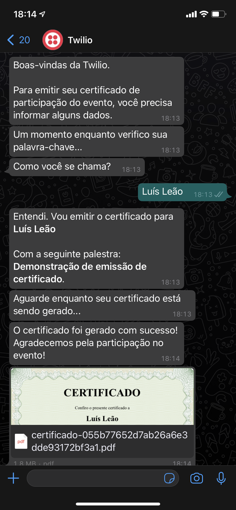

# Gerador de Certificados de Participação via WhatsApp

Este projeto utiliza a API de WhatsApp da Twilio e a Twilio Functions para validar e emitir certificados de participação de eventos via WhatsApp.

Ele foi utilizado como demonstração na The Developer's Conference, realizada nos dias 8 a 10 de Junho de 2021. A proposta é que ele sirva como ferramenta aberta para geração de certificados de eventos pelas comunidades de pessoas desenvolvedoras.

## Como contribuir com esse projeto?

Se você quer contribuir com esse projeto, entre em contato com lleao@twilio.com

## Resumo do funcionamento

A proposta é que o participante do evento envie uma mensagem para um número de WhatsApp ao assistir a palestra. Essa mensagem deve adicionar um código de validação que é fornecido ao vivo e esse código está vinculado a uma palestra ou atividade do evento.

Ao informar o código corretamente, o participante continuará no fluxo preenchendo seu nome e o sistema emitirá o certificado e o enviará diretamente pelo WhatsApp no formato PDF.

## Como foi desenvolvido?

Utilizamos o produto [Twilio Studio](https://www.twilio.com/studio) para construir o fluxo de validação e fizemos a conexão do Sandbox da API de WhatsApp diretamente com o webhook desse fluxo.

Uma vez que o participante inicie uma conversa, o fluxo pedirá um código de validação. Esse código é validado através de uma Twilio Function (/verifica-palavra-chave) que valida se o código existe e pode ser utilizado ou se é inválido.

Ao retornar da função, o fluxo confere o retorno e solicita o nome do participante. É possível implementar um fluxo de vínculo com algum registro em banco de dados posteriormente.

Ao receber os dados necessários, outra função é executada (/emite-certificado). Essa função recebe os parâmetros da atividade e do participante e cria uma nova mensagem adicionando como media um link do gerador de certificados (/pdf).

O gerador de certificados, também na Twilio Functions, fica responsável por criar um arquivo PDF temporário e retornar para a chamada da função. Utilizamos 3 cloud functions para conferir as palavras-chave disponíveis, construir a mensagem para emitir o certificado e a geração do arquivo PDF com o certificado.

## Lista de funcionalidades a serem implementadas
* Tokenização do certificado: como validar que o certificado foi emitido por um lugar confiável e como validar a emissão do certificado. Incluindo página do validador do certificado.
* "Profanity filter" do nome do participante.
* Vínculo em banco de dados do participante para validar a emissão com base apenas nos inscritos.
* Inclusão de imagem de assinatura do responsável pelo evento

